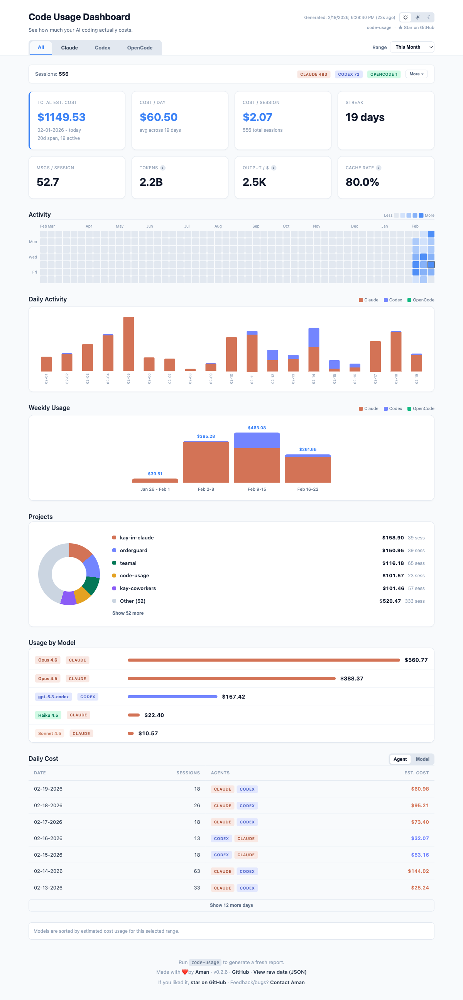

<div align="center">
  <h1>code-usage</h1>
  <p><strong>One command. Every AI coding tool. One dashboard.</strong></p>

  <a href="https://www.npmjs.com/package/code-usage"></a>
  <a href="https://www.npmjs.com/package/code-usage"></a>
  <a href="https://github.com/onlyoneaman/code-usage/blob/main/LICENSE"></a>
</div>

<br />

<div align="center">
  
</div>

<br />

```bash
npx code-usage
```

See how much your AI coding actually costs — across **all** your tools, in one place.

`code-usage` reads local session files, calculates API-equivalent costs, and builds a self-contained HTML dashboard. No accounts, no APIs, no data leaves your machine.

## Why code-usage?

Most usage trackers cover a single tool. If you use Claude Code *and* Codex *and* Amp, you need separate tools for each.

`code-usage` gives you **one unified dashboard** with combined views, stacked charts, and side-by-side comparisons — for every AI coding agent you use.

## Supported Tools

| Tool | Status |
|------|--------|
| [Claude Code](https://docs.anthropic.com/en/docs/claude-code) | Supported |
| [Codex CLI](https://github.com/openai/codex) | Supported |
| [OpenCode](https://opencode.ai) | Supported |
| [Amp](https://ampcode.com) | Supported |
| [Pi-Agent](https://github.com/anthropics/pi-agent) | Supported |

Only tools with local data appear in the dashboard — no empty tabs, no clutter.

## Features

- **Combined + per-agent views** — stacked charts showing cost breakdown across all your tools
- **Per-model costs** — see exactly which models eat your budget (Opus 4.6 vs Sonnet 4.5 vs GPT-5.3)
- **Per-project breakdown** — donut chart with cost/session data per project
- **Daily & weekly trends** — spot patterns in your usage over time
- **Date range filtering** — This Week, This Month, Last 30/90 Days, All Time
- **Dark mode** — System / Light / Dark theme toggle, persisted across sessions
- **Token breakdown** — input, output, cache read/write, reasoning tokens with tooltips
- **Usage streaks** — see your consecutive days of AI coding activity
- **Parallel collection** — gathers usage from all detected agents concurrently
- **JSON export** — `--json` flag for scripting and automation
- **100% offline** — everything runs locally, nothing is uploaded

## Quick Start

```bash
npx code-usage
```

Or install globally:

```bash
npm install -g code-usage
```

That's it. If you have session data from any supported tool, the dashboard opens automatically.

## CLI Options

```bash
code-usage                  # Open dashboard in browser
code-usage --no-open        # Generate HTML without opening
code-usage --json           # Print structured JSON to stdout
code-usage --range 30d      # Filter: 7d, 30d, 90d, all
code-usage -v               # Version
code-usage -h               # Help
```

## Output

```
~/.code-usage/current/code-usage-dashboard.html   # Interactive dashboard
~/.code-usage/current/openusage-data.json          # Raw data snapshot
```

## How It Works

1. Reads local session files from each tool's standard data directory (in parallel)
2. Calculates token counts and API-equivalent cost estimates per model
3. Aggregates by day, week, project, and model
4. Builds a single self-contained HTML file with all data inlined
5. Opens it in your browser

Pricing is based on published API rates. Fallback pricing powered by [LiteLLM](https://github.com/BerriAI/litellm). If you're on a subscription plan (Claude Max, Codex Pro), actual billed cost may differ.

## Privacy

All data stays on your machine. `code-usage` only reads standard local session files — no `.env`, no API keys, no network calls.

## Development

```bash
npm install
npm run lint              # Biome
npm test                  # Vitest (53 tests)
npm run build:dashboard   # Rebuild template
node bin/code-usage.js    # Run locally
```

## Links

- [npm](https://www.npmjs.com/package/code-usage)
- [GitHub](https://github.com/onlyoneaman/code-usage)
- [Author](https://x.com/onlyoneaman)

## License

[MIT](LICENSE) - [Aman](https://x.com/onlyoneaman)
