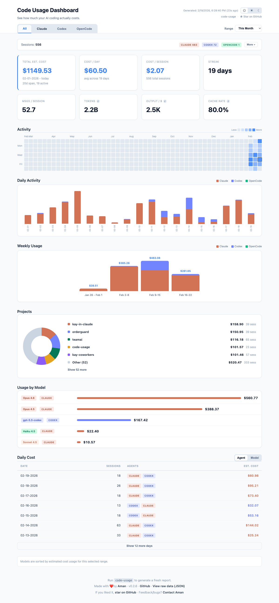

<div align="center">
  <h1>code-usage</h1>
  <p><strong>One command. Every AI coding tool. One dashboard.</strong></p>

  <a href="https://aicodeusage.com"></a>
  <a href="https://www.npmjs.com/package/code-usage"></a>
  <a href="https://www.npmjs.com/package/code-usage"></a>
  <a href="https://github.com/onlyoneaman/code-usage/blob/main/LICENSE"></a>
  <a href="https://github.com/onlyoneaman/code-usage"></a>
</div>

<br />

<div align="center">
  
</div>

<br />

```bash
npx code-usage
```

See how much your AI coding actually costs — across **all** your tools, in one place.

`code-usage` reads local session files, calculates API-equivalent costs, and builds a self-contained HTML dashboard. Optionally sync to [aicodeusage.com](https://aicodeusage.com) for a web dashboard you can check from anywhere.

## Why code-usage?

Most usage trackers cover a single tool. If you use Claude Code *and* Codex *and* Amp, you need separate tools for each.

`code-usage` gives you **one unified dashboard** with combined views, stacked charts, and side-by-side comparisons — for every AI coding agent you use.

## Supported Tools

| Tool | Status |
|------|--------|
| [Claude Code](https://docs.anthropic.com/en/docs/claude-code) | Supported |
| [Codex CLI](https://github.com/openai/codex) | Supported |
| [OpenCode](https://opencode.ai) | Supported |
| [Amp](https://ampcode.com) | Supported |
| [Pi-Agent](https://github.com/anthropics/pi-agent) | Supported |

Only tools with local data appear in the dashboard — no empty tabs, no clutter.

## Features

- **Combined + per-agent views** — stacked charts showing cost breakdown across all your tools
- **Per-model costs** — see exactly which models eat your budget (Opus 4.6 vs Sonnet 4.5 vs GPT-5.3)
- **Per-project breakdown** — donut chart with cost/session data per project
- **Daily & weekly trends** — spot patterns in your usage over time
- **Date range filtering** — This Week, This Month, Last 30/90 Days, All Time
- **Dark mode** — System / Light / Dark theme toggle, persisted across sessions
- **Token breakdown** — input, output, cache read/write, reasoning tokens with tooltips
- **Usage streaks** — see your consecutive days of AI coding activity
- **Parallel collection** — gathers usage from all detected agents concurrently
- **JSON export** — `--json` flag for scripting and automation
- **Cloud sync** — optional sync to [aicodeusage.com](https://aicodeusage.com) for a web dashboard
- **Background sync** — auto-syncs hourly via launchd (macOS), crontab (Linux), or Task Scheduler (Windows)
- **Works offline** — local dashboard works without an account; cloud sync is opt-in

## Quick Start

```bash
npx code-usage
```

Or install globally:

```bash
npm install -g code-usage
```

That's it. If you have session data from any supported tool, the dashboard opens automatically.

## Cloud Sync (Optional)

Pair your machine with [aicodeusage.com](https://aicodeusage.com) to get a web dashboard:

```bash
code-usage setup
```

This runs the full onboarding: login, first data collection, sync, and installs a background scheduler so your dashboard stays fresh automatically. You can also manage the connection manually:

```bash
code-usage login          # Pair this device
code-usage sync           # Upload latest data
code-usage status         # Show pairing & sync status
code-usage update         # Update the global package to the latest npm version
code-usage logout         # Unpair and stop syncing
code-usage config         # View/set config (e.g. syncIntervalMinutes)
```

Cloud sync is entirely opt-in. If you never run `setup` or `login`, nothing is uploaded and the CLI works fully offline.

## CLI Options

```bash
code-usage                  # Open dashboard in browser
code-usage --no-open        # Generate HTML without opening
code-usage --json           # Print structured JSON to stdout
code-usage --range 30d      # Filter: 7d, 30d, 90d, all
code-usage --providers codex,claude  # Run only selected providers
code-usage --timeout-ms 45000         # Per-provider timeout (ms)
code-usage --quiet          # Suppress progress logs
code-usage --verbose        # Print collector diagnostics
code-usage --update         # Same as: code-usage update (-update also works)
code-usage -v               # Version
code-usage -h               # Help
```

## Output

```
~/.code-usage/current/code-usage-dashboard.html   # Interactive dashboard
~/.code-usage/current/openusage-data.json          # Raw data snapshot
```

## How It Works

1. Reads local session files from each tool's standard data directory (in parallel)
2. Calculates token counts and API-equivalent cost estimates per model
3. Aggregates by day, week, project, and model
4. Builds a single self-contained HTML file with all data inlined
5. Opens it in your browser

Pricing is based on published API rates. Fallback pricing powered by [LiteLLM](https://github.com/BerriAI/litellm). If you're on a subscription plan (Claude Max, Codex Pro), actual billed cost may differ.

For Claude Code, subagent usage is included in total cost and token counts, but subagent runs do not inflate the main session count. Claude subagent runs are exposed separately in the JSON output.

## Privacy

By default, all data stays on your machine. `code-usage` only reads standard local session files — no `.env`, no API keys.

If you opt in to cloud sync, aggregated usage data (daily cost, token counts, session counts per provider) is sent to [aicodeusage.com](https://aicodeusage.com). No source code, file contents, or conversation data is ever uploaded. You can delete your account and all associated data from the web dashboard settings.

## Development

```bash
npm install
npm run lint              # Biome
npm test                  # Vitest (87 tests)
npm run build:dashboard   # Rebuild template
node bin/code-usage.js    # Run locally
```

## Links

- [Web Dashboard](https://aicodeusage.com) — cloud dashboard, leaderboard, multi-device sync
- [npm](https://www.npmjs.com/package/code-usage)
- [GitHub](https://github.com/onlyoneaman/code-usage)
- [Author](https://x.com/onlyoneaman) — [@onlyoneaman](https://x.com/onlyoneaman)
- Support: [hi@aicodeusage.com](mailto:hi@aicodeusage.com)

## License

[MIT](LICENSE) - [Aman](https://amankumar.ai)
